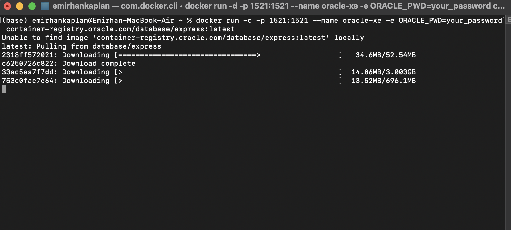
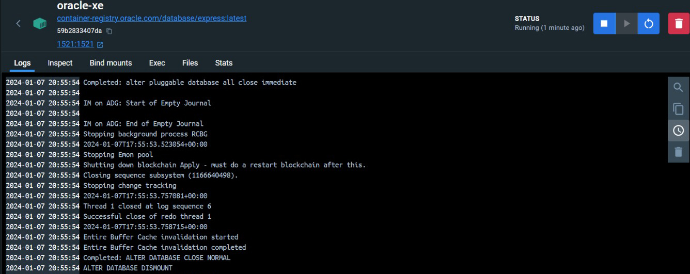
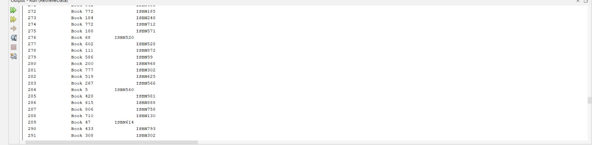

# Oracle Database XE with Docker — Java JDBC Examples

Running **Oracle Database Express Edition** in Docker and working with it from Java over **JDBC**: bulk-inserting random books and reading them back.

## 📦 What's inside

| File | Description |
| --- | --- |
| `Oracle/src/main/java/com/mycompany/oracleveri/InsertData.java` | Connects to Oracle XE and inserts 100 random rows into `BOOK` using the `BOOK_SEQ` sequence |
| `Oracle/src/main/java/com/mycompany/oracleveri/OracleVeri.java` | Main class of the project (same insert routine) |
| `Oracle/src/main/java/com/mycompany/oracleveri/RetrieveData.java` | Runs `SELECT * FROM BOOK` and prints `ID`, `NAME` and `ISBN` |

## 🧰 Tech stack

Java 8 · Maven · Oracle JDBC driver (ojdbc8 19.7) · Oracle Database XE · Docker

## 🚀 Running it

1. **Start Oracle XE in Docker**

   ```bash
   docker run -d -p 1521:1521 --name oracle-xe \
     -e ORACLE_PWD=<your_password> \
     container-registry.oracle.com/database/express:latest
   ```

2. **Create the table and the sequence** (for example with SQL*Plus or SQL Developer):

   ```sql
   CREATE TABLE BOOK (
     ID   NUMBER PRIMARY KEY,
     NAME VARCHAR2(100),
     ISBN VARCHAR2(20)
   );

   CREATE SEQUENCE BOOK_SEQ START WITH 1 INCREMENT BY 1;
   ```

3. **Set the connection details** (`jdbcURL`, `username`, `password`) in the Java files — the default URL is `jdbc:oracle:thin:@localhost:1521/xe`.

4. **Insert and read the data**

   ```bash
   cd Oracle
   mvn compile exec:java -Dexec.mainClass=com.mycompany.oracleveri.InsertData
   mvn compile exec:java -Dexec.mainClass=com.mycompany.oracleveri.RetrieveData
   ```

## 📸 Screenshots

**Pulling and starting the Oracle XE image**



**The `oracle-xe` container in Docker Desktop**



**Records read back from the `BOOK` table**


